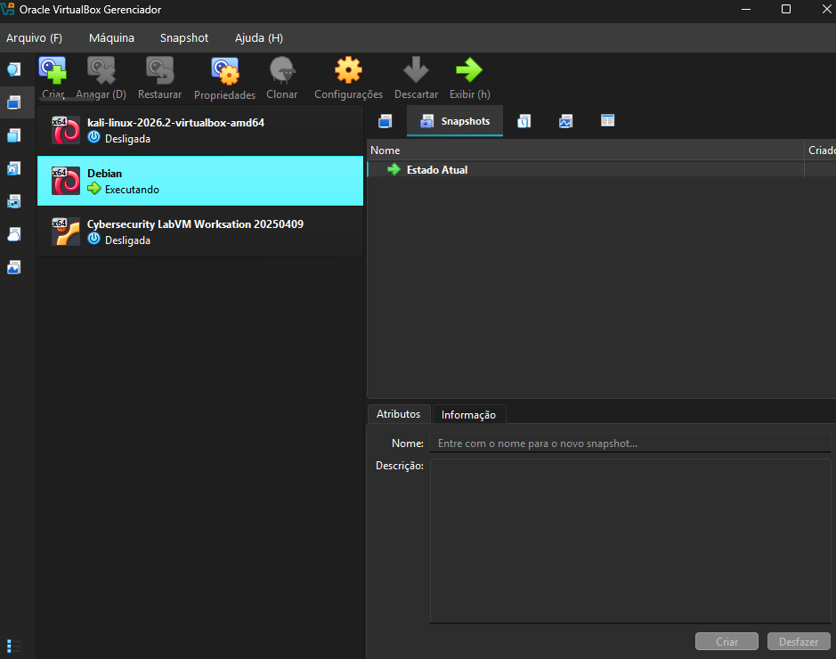
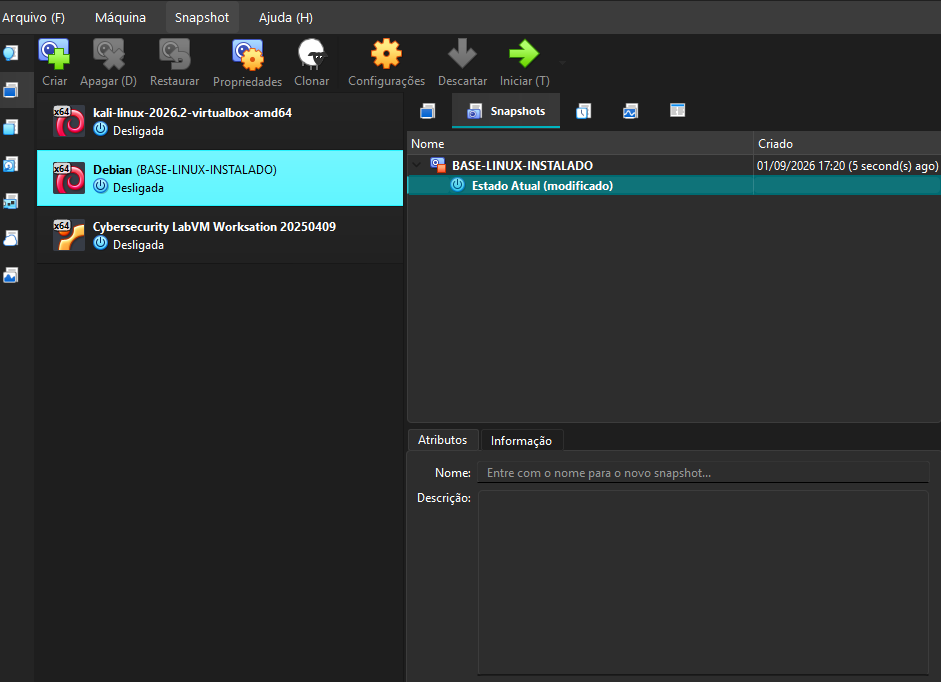
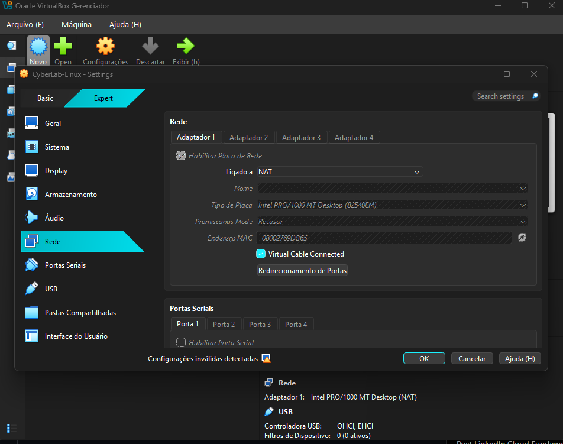
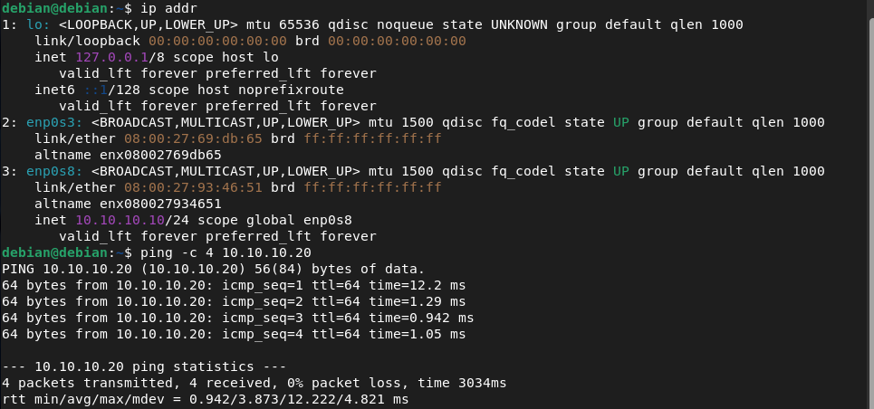

# Semana 01 — Fundamentos de Linux, Redes e CyberLab

## 🎯 Objetivo
Estruturar o ambiente de estudos, configurar a rede isolada do laboratório e dominar comandos essenciais de inspeção de sistema e redes no Linux.

---

## 📅 Progresso Diário

- **Dia 01:** Conceitos fundamentais de hardware, processos e gerenciamento de máquinas virtuais.
- **Dia 02:** Inventário do Debian e Kali Linux, criação da rede interna `CYBERLAB-INTERNAL`, atribuição de IPs estáticos (`10.10.10.10` e `10.10.10.20`), validação de conectividade ICMP e criação de snapshots.

---

## 🛠️ Comandos Aprendidos (Dia 02)

| Comando | Para que serve | O que observei no laboratório |
| :--- | :--- | :--- |
| `pwd` | Mostra o diretório atual | Identifica a pasta de trabalho atual |
| `ls -la` | Lista todos os arquivos com detalhes | Exibe permissões, donos e arquivos ocultos |
| `ps aux` | Lista todos os processos do sistema | Exibe usuário, PID, consumo de CPU e RAM |
| `df -h` | Mostra uso do disco/sistema de arquivos | Exibe espaço livre em GB de forma legível |
| `free -h` | Mostra utilização da memória RAM e Swap | Exibe RAM total, em uso e disponível |
| `hostnamectl` | Mostra detalhes do sistema e hostname | Exibe nome da VM, Kernel, Arquitetura e SO |
| `ip addr` | Lista as interfaces de rede e seus IPs | Mostra os IPs das placas NAT e Rede Interna |
| `ip route` | Exibe a tabela de roteamento e gateway | Identifica a rota padrão (`default via 10.0.2.2`) |
| `sudo ip addr add <IP/MÁSCARA> dev <IF>` | Atribui IP estático temporário | Configurado `10.10.10.10` (Debian) e `10.10.10.20` (Kali) |
| `sudo ip link set <IF> up` | Ativa a interface de rede | Habilita a placa interna para tráfego de pacotes |
| `ping -c <QTD> <DESTINO>` | Testa a conectividade (ICMP) | Validou 0% de perda entre Kali e Debian na rede isolada |

---

## 📸 Evidências do Laboratório (Dia 02)

### 1. Painel Geral do VirtualBox

*Painel de gerenciamento do VirtualBox exibindo as VMs preparadas para o CyberLab v1.0.*

### 2. Status de Execução do Debian

*VM Debian 13 (CyberLab-Linux) ativa no VirtualBox com configurações base.*

### 3. Snapshot de Segurança

*Ponto de restauração BASE-LINUX-INSTALADO criado no VirtualBox.*

### 4. Configuração da Placa NAT (Adaptador 1)

*Adaptador 1 habilitado em modo NAT para acesso à internet.*

### 5. Teste de Conectividade na Rede Interna

*Sucesso no ping do Debian (10.10.10.10) para o Kali Linux (10.10.10.20) com 0% de perda.*
